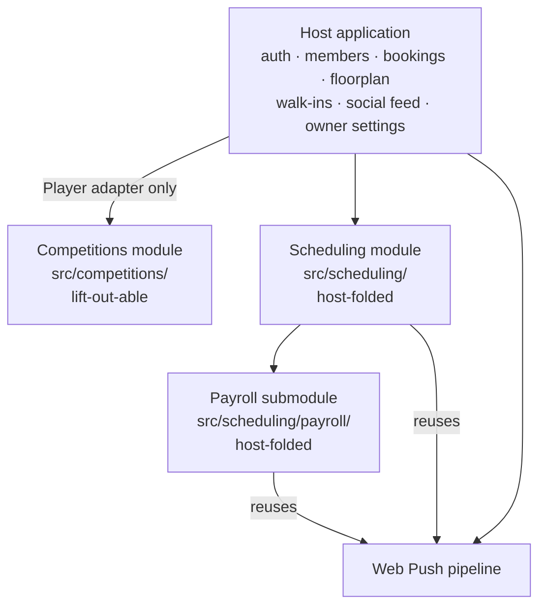
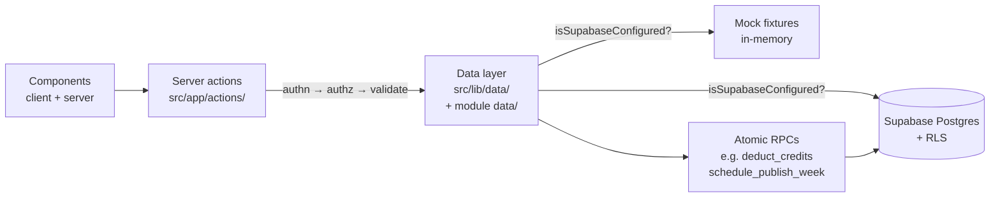
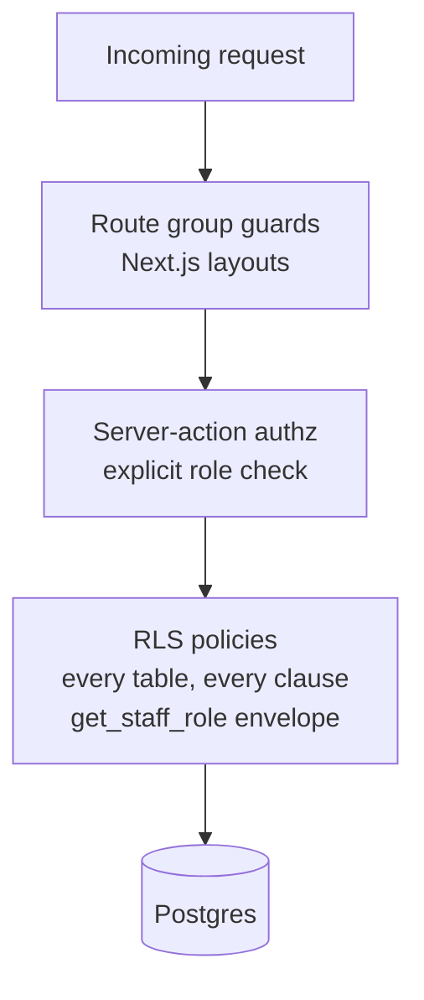

# Architecture

## Overview

Tigress is a club management platform for a bar and billiards venue in
Singapore — roughly 30 active members, seven pool tables, four roles
(member, staff, manager, owner). It is **not** a point-of-sale and **not**
a billing system. Qashier handles the till; Stripe handles subscriptions;
Tigress is the operational hub that sits alongside both. Its job is the
work that neither of those tools does: bookings, the floorplan, walk-in
tracking, member lifecycle, staff scheduling, payroll, competitions, and
the social feed that ties the community together. Production deploys live
on Vercel; the database is Supabase in `ap-southeast-1`. Every external
boundary is narrow: Stripe enters as webhooks only, Qashier doesn't enter
at all, and push delivery is self-hosted via VAPID.

## Stack

Pulled from `package.json` (Session 28, repo state as of S27b-fix):

- **Next.js** 14.2.15 — App Router, Server Actions, route groups, no
  pages router.
- **TypeScript** 5.x in strict mode. `tsconfig.json` is the source of
  truth; `npx tsc --noEmit` is part of the mandatory pre-commit gate.
- **Tailwind CSS** 3.4.x. Dark theme is the only theme. Mobile-first.
- **Supabase** — `@supabase/supabase-js` 2.45.x and `@supabase/ssr` 0.5.x.
  Postgres + Auth + Realtime, single project in `ap-southeast-1`. RLS is
  on for every table without exception.
- **Stripe** SDK 22.x, used only in the webhook receiver and (eventually)
  for billing-portal redirects. Tigress writes to Stripe never; Stripe
  writes to Tigress only via signed webhooks.
- **web-push** 3.6.x — Web Push API delivery, signed with self-managed
  VAPID keys. No third-party push service.
- **@react-pdf/renderer** 4.5.x — payslip PDF generation, server-side.
- **jszip** 3.10.x — payroll CSV bundles.
- **lucide-react** for icons throughout.
- **Vitest** 2.1.x for the test suite. esbuild transpile, JSDOM where
  needed.
- **Vercel** for hosting. The production runtime is Node.js, UTC-clocked.
  All venue-time arithmetic goes through `src/lib/timezone.ts`.
- **GitHub Actions** for cron. Vercel Hobby caps cron frequency at
  1/day, so scheduled jobs (booking reminders, shift notifications) run
  from `.github/workflows/*.yml` and `curl` Next.js API routes with a
  bearer token.

The PWA is hand-written — manifest at `public/manifest.json`, service
worker at `public/sw.js`. **No `next-pwa`, no `workbox`** (see ADR-017).
Push delivery is hand-wired via `web-push` — **no OneSignal, no FCM**
(see ADR-018).

## Design system

The visual design is defined in code, not in this document. The
structural choices are:

- **Plus Jakarta Sans** as the primary type, variable-weight via
  `@fontsource-variable/plus-jakarta-sans`.
- **Dark-only theme** on `#0F0F23` background. There is no light theme
  and no theme toggle. The primary accent is `#E94560`.
- **Four-level surface elevation:** `background → surface-1 →
  surface-2 → surface-3` mapped in `tailwind.config.ts`. UI components
  pick a layer rather than mixing arbitrary greys.
- **Lucide React** icons throughout. Standard sizes, consistent stroke
  width — the choice of "what icon means what" lives in components, not
  here.
- **Tier accents** on membership cards: silver for Standard, gold for
  Premium. The accent treatment is the only thing that distinguishes
  tier UI elements; everything else stays neutral.
- **Mobile-first** layouts with iPhone safe-area support. Members get a
  bottom nav; staff and owners get a sidebar on desktop and a bottom
  nav on tablet/phone (where they're most likely to be working on the
  floor).

Specific Tailwind classes, icon sizes, and spacing scales live in
component source files. They evolve too quickly to track here.

## Module map



Three modules sit on top of the host application:

- **Host application** — `src/app/`, `src/components/`,
  `src/lib/{auth,data,stripe,supabase,push,pwa,...}`. Everything
  member-facing and operational that isn't competitions, scheduling, or
  payroll. Owns identity, role resolution, the floorplan, the booking
  flow, the social feed, owner settings.
- **Competitions module** — `src/competitions/`. Tournaments, leagues,
  ladders, and the surrounding tables, players, teams, fixtures,
  standings, promotion/relegation. Designed to be lift-out-able as a
  standalone product (see "Module boundary invariants" below).
- **Scheduling module** — `src/scheduling/`. Shift templates,
  qualifications, FT/PT staff assignments, weekly drafts, publish flow,
  clock records, swaps, no-show tracking. Host-folded by deliberate
  choice — it reuses too much host infrastructure to be worth
  isolating.
- **Payroll submodule** — `src/scheduling/payroll/`. Pay runs, rate
  resolution, overtime classification, line-item aggregation, payslip
  PDF/CSV/JSON exports, owner settings UI for rates and holidays. Lives
  inside the scheduling module because it consumes scheduling's clock
  records as its input.

## Module boundary invariants

The two non-host modules have **deliberately asymmetric** boundary
discipline. Competitions is fenced; scheduling+payroll is folded.

### Competitions — lift-out-able

Designed for potential extraction as a standalone competitions product.
Boundary rules:

- Nothing outside `src/competitions/` imports from inside the module
  *except* route pages in `src/app/(community)/competitions/` and
  `src/app/(community)/leagues/`, plus the nav entry in
  `src/components/ui/StaffSidebar.tsx` and a small set of test helpers.
- Nothing inside `src/competitions/` imports from elsewhere in Tigress
  *except* via:
  - `src/competitions/data/players.ts` — the **Player adapter**, the
    only file in the module that imports `@/lib/data/members`,
    `@/lib/data/staff`, or `@/lib/auth/*`. Translates `Member` and
    `Staff` rows into the module's internal `Player` / `PlayerRef`
    types.
  - `src/competitions/audit.ts` — the audit wrapper that prefixes every
    event with `comp.*`.
  - `src/competitions/events.ts` — the events hook for cross-module
    fanout (currently a no-op placeholder for future feed auto-posts).
  - Shared primitives: `@/lib/supabase/*`, `@/lib/timezone`,
    `@/lib/types`, `@/lib/format`. These are stable enough to count as
    standard library.
- All audit events prefixed `comp.*`. All tables prefixed `comp_`.

The boundary is enforced by `tests/competitions/boundary.test.ts`,
which greps every TypeScript file under `src/` for forbidden imports
and asserts both directions of the rule. The two test cases are:

1. *outside files do not import from src/competitions/ unless
   whitelisted*
2. *inside files do not import host code unless whitelisted*

The allow-list is encoded in the test itself, not in a JSON
side-file — this is intentional, so adding an integration point
requires editing the test (and thinking about whether it should be
allowed).

### Scheduling + payroll — host-folded

Deliberately not isolated. Reasons:

- Reuses host primitives top to bottom: `staff` rows for identity,
  `members` table for nothing (scheduling is purely a staff concern),
  the role hierarchy, the audit log, the Web Push subscription table
  and pipeline.
- Has no plausible standalone product story. Payroll for a
  thirty-person bar is not a SaaS.
- Isolating it would mean either (a) duplicating identity, audit, and
  push, or (b) building an adapter layer for each — neither of which
  earns its keep.

What it still keeps:

- **Table prefixes:** `schedule_*` for runtime, `schedule_payroll_*`
  for payroll, `payroll_venue_branding` for the singleton branding row
  on payslips.
- **Audit prefixes:** `schedule.*` for runtime events, `payroll.*` for
  pay-run lifecycle and exports. The two namespaces are split because
  retention needs differ — payroll is the slow-moving record-of-truth;
  scheduling is operational chatter.
- **Cross-module guard:** there is no scheduling↔competitions import.
  Neither module needs the other; the discipline is "stay out of each
  other's business".

## Data flow



Every request follows the same shape:

1. **Components** call server actions. Client components do this via
   `useTransition` + form actions; server components do it directly.
2. **Server actions** (`src/app/actions/*.ts` for the host;
   `src/competitions/actions/*.ts`, `src/scheduling/actions/*.ts`,
   `src/scheduling/payroll/actions/*.ts` for the modules) follow a
   strict order: authenticate → authorize → validate → call data
   function → revalidate paths → return `{ success, error? }`.
3. **Data layer** is the only place that touches Supabase. Every file
   imports `"server-only"` so accidental client imports fail at build
   time (see ADR-019). Each function checks `isSupabaseConfigured()`
   and branches: real path hits Postgres, mock path mutates in-memory
   fixtures. Both paths must stay in sync.
4. **Atomic mutations** that touch multiple rows or need row-level
   locking are pushed into Postgres RPCs (see "Patterns: atomic state
   via Postgres RPC"). Examples: `deduct_credits`, `refund_credits`,
   `schedule_publish_week`, `schedule_lock_clock_records`,
   `schedule_payroll_lock_run`, `comp_set_fixture_participants`,
   `comp_finalize_division_promotions`.

## Authorization layers

Three concentric layers. All three are required; none is sufficient
alone. This is defense in depth, not redundancy — each catches a
different class of mistake.



- **RLS policies** on every table. The NULL-coalescence rule (every
  USING / WITH CHECK clause's top-level OR-branches must reference
  `public.get_staff_role()`) is enforced by the test suite — see
  `tests/security/rls-pattern.test.ts`. The history of why this rule
  exists is in PATTERNS.md.
- **Server-action authorization** checks role explicitly before any
  data call. Even if RLS were misconfigured, the action would refuse.
  Even if the action were misconfigured, RLS would refuse. Owner-only
  actions check for owner; manager+ actions check for manager or
  owner; etc. The role-write matrix at
  `tests/security/role-write-matrix.test.ts` ensures action-layer
  expectations and RLS-layer policies don't drift apart.
- **Route-group guards** via Next.js layouts: `(auth)/` for the public
  flows (login, register, forgot-password); `(member)/` for any
  authenticated role; `(staff)/` for staff and above; `(owner)/` for
  owner only; `(community)/` for any authenticated role (feed,
  competitions, leagues). This catches whole categories of
  navigation mistakes — a member who tries to deep-link into a manager
  page never reaches the action layer.

The role hierarchy is **member < staff < manager < owner**. Each rank
inherits permissions from the rank below. Role resolution checks the
`staff` table first (returns staff/manager/owner), then `members`
(returns member); auth users with no row in either table are treated
as orphans and signed out. Members whose `subscription_status` is
`suspended` or `cancelled` are blocked at sign-in.

## Mock mode

Tigress runs end-to-end without Supabase. Mock mode activates whenever
`isSupabaseConfigured()` returns false — this happens when the
`NEXT_PUBLIC_SUPABASE_URL` or `NEXT_PUBLIC_SUPABASE_ANON_KEY` env vars
are missing or left at their `.env.local.example` placeholders. In
mock mode:

- Every data-layer function takes the in-memory branch. Mutations
  modify arrays in `src/lib/data/mock-data.ts` (host) and the
  module-owned `mock-data.ts` files (competitions, scheduling, payroll).
- Auth uses `src/lib/auth/mock-users.ts`. Sessions are stored in a
  cookie + localStorage so the middleware and server actions can still
  resolve "who am I".
- Stripe webhooks accept any payload and return 200 without doing
  anything.
- Push notifications log the payload and return; subscriptions live
  in an in-memory array.
- Cron routes short-circuit with `{ sent: 0, mock: true }`.

This is not a "demo mode" — it's the development and CI baseline. Real
mode is the deployment configuration. Both paths must stay in sync;
mock/real parity is non-negotiable (see ADR-002 and ADR-009).

Test accounts (password is `password` for all four):

| Email | Role |
|---|---|
| `member@tigress.test` | member |
| `staff@tigress.test` | staff |
| `manager@tigress.test` | manager |
| `owner@tigress.test` | owner |

Two PT staff added in S25 for scheduling work: `pat@tigress.test`
and `phoebe@tigress.test`.

## Migration discipline

Migrations live in `supabase/migrations/`, are append-only, and are
numbered. The current count is **24** (`001_initial_schema.sql`
through `024_s27b.sql`). Some carry a session suffix
(`014_s24a_schedule_and_galas.sql`, `017_s24b2_promotion_relegation.sql`,
`023_s27a_fix_2.sql`) so the trail back to "why this exists" is
visible in the filename.

The cardinal rule, crystallized in Session 9 after a fix to
`001_initial_schema.sql`: **helper functions cannot reference tables
that don't yet exist at the point the function is created**. The
original migration defined `public.get_staff_role()` (which selects
from `staff`) before `staff` was created. Postgres accepts the
function definition with a deferred reference, but RLS policies that
*use* the function fail at policy creation time. The fix was to
reorder the migration so all table DDL precedes the helper functions
that depend on it. See ADR-012.

## PWA architecture

- **Manifest:** `public/manifest.json`, wired into the root layout
  via Next.js `metadata.manifest`. The `theme_color` and
  `background_color` must stay in sync with the `#0F0F23` background
  defined in `tailwind.config.ts` and `src/app/layout.tsx`.
- **Service worker:** `public/sw.js`, hand-written, versioned cache.
  Strategy summary:
  - **Navigation (HTML):** network-first, falls back to the cached
    `/offline.html`.
  - **Static assets** (`/icons/*`, `/manifest.json`, `/offline.html`):
    cache-first.
  - **Everything else** (Next.js JS bundles, API routes, Supabase
    Realtime WebSockets, cross-origin requests): passthrough.
    **Next.js bundles must never be cached** — they're hash-named, so
    caching them strands clients on stale JS after deploy.
  - WebSockets aren't intercepted by `fetch` handlers, so Supabase
    Realtime is unaffected by SW caching.
- **Offline shell:** `public/offline.html` is the static fallback the
  SW serves. `src/app/offline/page.tsx` mirrors its markup so
  `/offline` resolves online too. When editing one, edit both.
- **Registration:** `src/components/pwa/ServiceWorkerRegistration.tsx`
  renders nothing; mounted from the root layout.
- **Install banner:** `src/components/pwa/InstallBanner.tsx` covers
  three platforms: Chromium (`beforeinstallprompt` → native install
  button), iOS Safari (manual "Share → Add to Home Screen"
  instructions), standalone or unsupported (banner hidden silently).
  Install detection is the bulk of the logic, not the install action
  itself; pure detection lives in `src/lib/pwa/install-banner.ts` and
  is covered by `tests/pwa/install-banner.test.ts`.

The PWA is hand-written for total control over cache strategy and a
single-file mental model. See ADR-017 for the alternative considered
and rejected.

## Push notification architecture

Web Push API + VAPID, delivered via the `web-push` npm package
running on Vercel functions. No third-party push service (see
ADR-018).

- **Keys:** generated once via `node scripts/generate-vapid-keys.js`.
  Two env vars: `NEXT_PUBLIC_VAPID_PUBLIC_KEY` (browser) and
  `VAPID_PRIVATE_KEY` (server). Rotating either invalidates every
  subscription; clients have to re-enable from `/profile`.
- **Storage:** the `push_subscriptions` table holds one row per
  device, unique on `endpoint`. The check constraint
  `member_id IS NOT NULL OR staff_id IS NOT NULL` prevents orphan
  subscriptions. RLS scoped so each user can only manage their own
  rows; the service role bypasses RLS for server-side delivery.
- **Sender API:** `sendPushToMember`, `sendPushToMembers`,
  `sendPushToStaff`, `sendPushToStaffMembers` in
  `src/lib/push/send.ts`. All four are **fire-and-forget** with
  try/catch — a failed push must never break the originating business
  flow. 404 and 410 responses trigger automatic cleanup of the dead
  subscription.
- **Triggers:** booking confirmation (to booker), booking cancellation
  (to every accepted invitee, fetched *before* the cancel),
  invite-received (to invitee), booking reminder (45–75 min window via
  cron), schedule publish (to assigned staff), schedule unpublish (to
  previously-assigned staff), shift assign/unassign post-publish (to
  affected staff), payroll lock (to staff with line items in the run),
  payroll unlock (same audience). New triggers are added as features
  ship; the pipeline itself doesn't change.
- **iOS gating:** Web Push only works on iOS 16.4+ AND only in
  standalone mode. The toggle in `/profile` shows the appropriate
  message ("Install to home screen" vs. "iOS 16.4+ required") instead
  of a broken button.

## Cron architecture

Scheduled jobs run from GitHub Actions, not from Vercel Cron. Vercel
Hobby caps cron frequency at 1/day, which is too coarse for booking
reminders (every 15 minutes) and shift notifications (similar
cadence). The workflows live in `.github/workflows/*.yml`.

Pattern:

1. GitHub Actions cron triggers a workflow.
2. The workflow `curl`s a Next.js API route at the deployment origin
   with `Authorization: Bearer $CRON_SECRET`.
3. The route verifies the bearer token first (401 otherwise),
   short-circuits in mock mode, and runs the job.
4. **Idempotency** is per-row, via a timestamp column
   (`reminder_sent_at` for bookings; a dedup table for shift
   notifications). The timestamp is stamped *after* the attempt, so a
   failed send retries on the next tick.
5. Per-item failures are logged and do not halt the batch.

If the deployment ever moves to Vercel Pro, the `crons` block can be
restored in `vercel.json` and the workflows deleted.

Required env vars / secrets: `CRON_SECRET` (Vercel env + matching
GitHub Actions secret); `CRON_TARGET_URL` (GitHub Actions secret with
the deployment origin).

## Realtime architecture

Live surfaces — primarily the floorplan — combine three sources of
truth so the UI stays current without depending on any one of them:

1. **Supabase Realtime** subscriptions for inserts/updates on the
   relevant tables.
2. **30-second polling** as a fallback. Realtime is best-effort;
   poll guarantees eventual consistency.
3. **Visibility-change refresh** when the tab becomes visible. Phones
   sleep, tabs deprioritize; on focus the UI re-fetches.

All three converge on the same data-layer functions, so there is one
source of truth for "what does the floorplan look like right now". The
hook is `src/hooks/useFloorplanRealtime.ts`.

## Test architecture

Five categories, kept in distinct directories:

- **Pure libraries** — algorithms in isolation, no infrastructure.
  `tests/competitions/lib/` (4 files: bracket, promotion-planner,
  schedule, standings); `tests/scheduling/lib/` (6 files:
  attendance-state, availability-check, clock-rounding, coverage,
  materialize, swap-eligibility); `tests/scheduling/payroll/lib/` (7
  files: csv, engine, line-item-aggregation, overtime-classification,
  payslip-pdf, payslip-transformer, rate-resolution); plus
  `tests/lib/` for shared utilities (env, format, timezone, youtube).
- **Data layer** — mock-mode behaviour for every dual-mode function.
  `tests/data/`, `tests/competitions/data/`, `tests/scheduling/data/`,
  `tests/scheduling/payroll/data/`.
- **Action layer** — server actions with role gating, validation, and
  side-effect verification. `tests/actions/`,
  `tests/competitions/actions/`, `tests/scheduling/actions/`,
  `tests/scheduling/payroll/actions/`.
- **Security tests** — `tests/security/rls-pattern.test.ts` (RLS
  NULL-coalescence guard with boolean-aware OR-branch parsing;
  exemptions in `rls-allowlist.json`) and
  `tests/security/role-write-matrix.test.ts` (manifest-driven assertion
  that action-layer write authority and RLS write policies agree).
- **Structural tests** — `tests/competitions/boundary.test.ts` is the
  module boundary grep guard. Other categories: PWA install-banner
  detection, Stripe webhook handlers, the booking-reminders cron route.

Current count: **1173 tests across 95 files**, all green
(verified at Session 28 commit time).

## Repository layout

```
src/
  app/
    (auth)/           public — login, register, forgot-password
    (member)/         any authenticated — dashboard, book, bookings, profile, invites
    (staff)/          staff+ — floor, calendar, walk-in, members, manager, block
    (owner)/          owner only — settings, rates, owner
    (community)/      any authenticated — feed, competitions, leagues
    actions/          host server actions, one file per domain
    api/              register, webhooks/stripe, cron/*
    layout.tsx        root layout, mounts SW + InstallBanner
    offline/          mirrors public/offline.html
  components/
    auth/             RouteGuard, LogoutButton
    ui/               nav, header, skeletons, AccessDenied, StaffSidebar
    booking/          BookingFlow, slot picker
    floorplan/        FloorplanLayout, TableDetailPanel, StaffFloorView
    calendar/         CalendarDayView, CalendarWeekView
    feed/             FeedClient, PostCard, LikeButton, PostComposer
    pwa/              ServiceWorkerRegistration, InstallBanner, PushSubscription
    member/, staff/, owner/   role-specific surfaces
  lib/
    auth/             AuthContext, AuthProvider, mock-users
    data/             host data accessors, server-only, dual-mode
    push/             send.ts, types
    pwa/              install-banner detection
    stripe/           webhook handlers
    supabase/         client, server, admin, middleware, env
    types/            shared TypeScript types
    timezone.ts, format.ts, constants.ts, youtube.ts
  competitions/       module — see boundary rules above
  scheduling/         module — host-folded
    payroll/          submodule
  hooks/              useAuth, useFloorplanRealtime
  middleware.ts       session refresh + route protection
public/
  manifest.json, sw.js, offline.html, icons/
supabase/
  migrations/         001..024
tests/
  actions/, api/, data/, lib/, pwa/, stripe/, cron/
  competitions/       lib + data + actions + boundary + components
  scheduling/         lib + data + actions
  scheduling/payroll/ lib + data + actions
  security/           rls-pattern, role-write-matrix
.github/workflows/    cron jobs (booking-reminders, shift-notifications)
```

Top-level files: `package.json`, `tsconfig.json`, `next.config.mjs`,
`tailwind.config.ts`, `vercel.json`, `vitest.config.ts`,
`postcss.config.mjs`. The four canonical engineering docs (this file,
`DECISIONS.md`, `PATTERNS.md`, `PROCESS.md`) and the historical
handover archive live under `docs/`.
